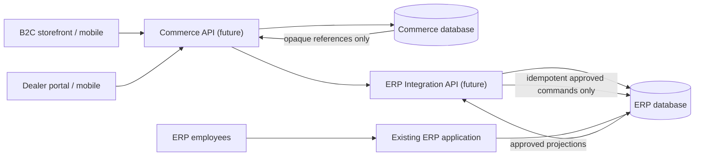

# System Data Ownership

Commerce owns customer/dealer identities, merchandising, carts, quotes and staged orders. ERP owns operational product facts, physical inventory, billing, GST, invoices, returns and staff identity. There is no direct Commerce-to-ERP database path.

