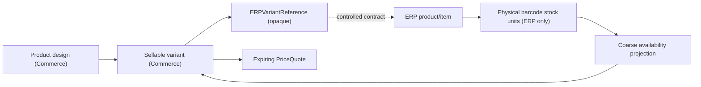

# Product to Physical Stock Relationship

```mermaid
flowchart LR
  P["Product design (Commerce)"] --> V["Sellable variant (Commerce)"]
  V --> VR["ERPVariantReference (opaque)"]
  VR -. "controlled contract" .-> EI["ERP product/item"]
  EI --> PS["Physical barcode stock units (ERP only)"]
  PS --> AP["Coarse availability projection"]
  AP --> V
  V --> PQ["Expiring PriceQuote"]
```

Physical barcodes and ERP row identifiers never become public product identifiers.

