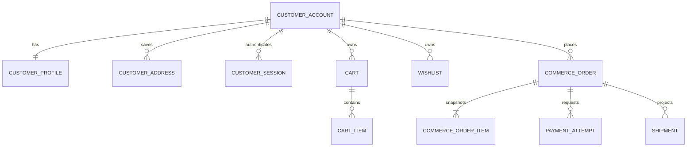

# B2C Account and Order

```mermaid
erDiagram
  CUSTOMER_ACCOUNT ||--|| CUSTOMER_PROFILE : has
  CUSTOMER_ACCOUNT ||--o{ CUSTOMER_ADDRESS : saves
  CUSTOMER_ACCOUNT ||--o{ CUSTOMER_SESSION : authenticates
  CUSTOMER_ACCOUNT ||--o{ CART : owns
  CART ||--o{ CART_ITEM : contains
  CUSTOMER_ACCOUNT ||--o{ WISHLIST : owns
  CUSTOMER_ACCOUNT ||--o{ COMMERCE_ORDER : places
  COMMERCE_ORDER ||--|{ COMMERCE_ORDER_ITEM : snapshots
  COMMERCE_ORDER ||--o{ PAYMENT_ATTEMPT : requests
  COMMERCE_ORDER ||--o{ SHIPMENT : projects
```

