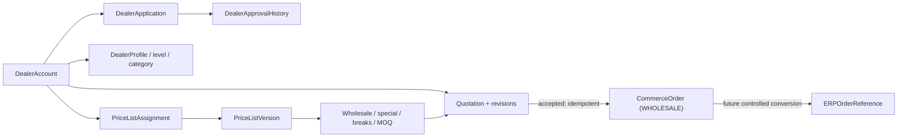

# B2B Dealer, Pricing, Quotation and Order

```mermaid
flowchart LR
  DA["DealerAccount"] --> APP["DealerApplication"]
  APP --> AH["DealerApprovalHistory"]
  DA --> PROF["DealerProfile / level / category"]
  DA --> PLA["PriceListAssignment"]
  PLA --> PLV["PriceListVersion"]
  PLV --> RULE["Wholesale / special / breaks / MOQ"]
  DA --> Q["Quotation + revisions"]
  RULE --> Q
  Q -->|"accepted; idempotent"| O["CommerceOrder (WHOLESALE)"]
  O -->|"future controlled conversion"| ER["ERPOrderReference"]
```

