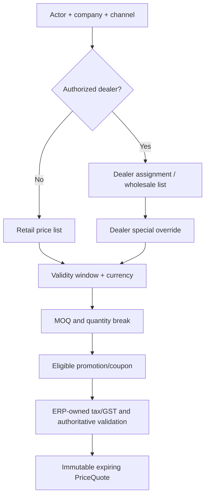

# Pricing Resolution Flow

```mermaid
flowchart TD
  A["Actor + company + channel"] --> AUTH{"Authorized dealer?"}
  AUTH -->|"No"| R["Retail price list"]
  AUTH -->|"Yes"| W["Dealer assignment / wholesale list"]
  W --> S["Dealer special override"]
  R --> V["Validity window + currency"]
  S --> V
  V --> QTY["MOQ and quantity break"]
  QTY --> PROMO["Eligible promotion/coupon"]
  PROMO --> ERP["ERP-owned tax/GST and authoritative validation"]
  ERP --> QUOTE["Immutable expiring PriceQuote"]
```

No wholesale rule is returned before server-side dealer authorization. Silver-rate and making-charge calculations remain undecided and future-only.

