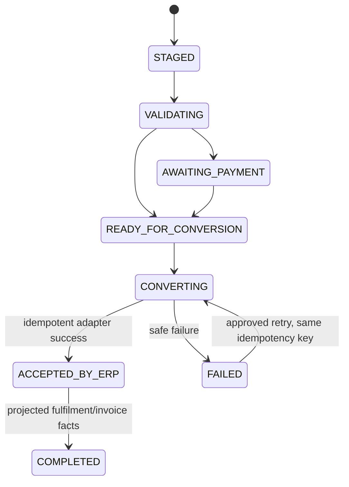

# Order Conversion to ERP

```mermaid
stateDiagram-v2
  [*] --> STAGED
  STAGED --> VALIDATING
  VALIDATING --> AWAITING_PAYMENT
  VALIDATING --> READY_FOR_CONVERSION
  AWAITING_PAYMENT --> READY_FOR_CONVERSION
  READY_FOR_CONVERSION --> CONVERTING
  CONVERTING --> ACCEPTED_BY_ERP: idempotent adapter success
  CONVERTING --> FAILED: safe failure
  FAILED --> CONVERTING: approved retry, same idempotency key
  ACCEPTED_BY_ERP --> COMPLETED: projected fulfilment/invoice facts
```

Commerce never writes ERP billing, stock, order or invoice tables. One unique conversion key prevents duplicate ERP acceptance.

