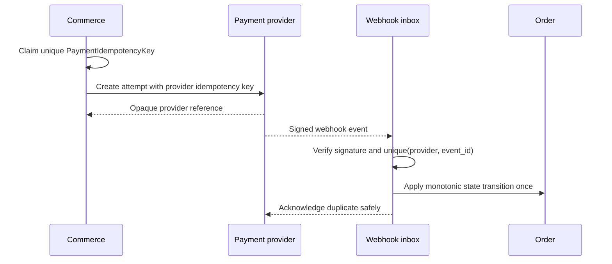

# Payment Idempotency Flow

```mermaid
sequenceDiagram
  participant C as Commerce
  participant P as Payment provider
  participant W as Webhook inbox
  participant O as Order
  C->>C: Claim unique PaymentIdempotencyKey
  C->>P: Create attempt with provider idempotency key
  P-->>C: Opaque provider reference
  P-->>W: Signed webhook event
  W->>W: Verify signature and unique(provider, event_id)
  W->>O: Apply monotonic state transition once
  W-->>P: Acknowledge duplicate safely
```

