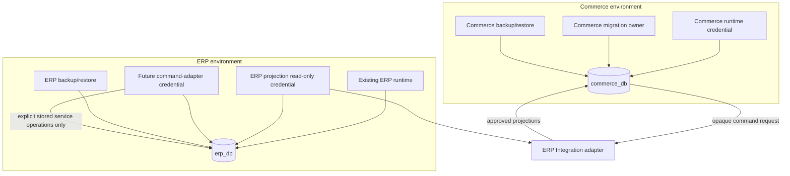

# Commerce and ERP Database Separation

```mermaid
flowchart TB
  subgraph CommerceEnvironment["Commerce environment"]
    CR["Commerce runtime credential"] --> CDB[("commerce_db")]
    CM["Commerce migration owner"] --> CDB
    CB["Commerce backup/restore"] --> CDB
  end
  subgraph ERPEnvironment["ERP environment"]
    ER["Existing ERP runtime"] --> EDB[("erp_db")]
    RO["ERP projection read-only credential"] --> EDB
    CA["Future command-adapter credential"] --> EDB
    EB["ERP backup/restore"] --> EDB
  end
  RO --> AD["ERP Integration adapter"]
  AD -->|"approved projections"| CDB
  CDB -->|"opaque command request"| AD
  CA -->|"explicit stored service operations only"| EDB
```

Databases may initially share a MySQL server, but schemas, credentials, migrations, backups and restores remain separate.

