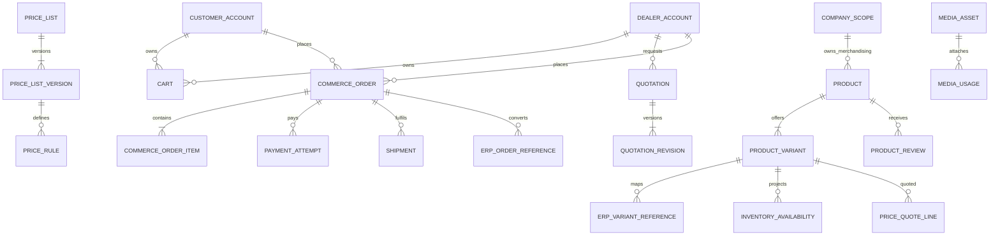

# Major Entity Relationship Diagram

```mermaid
erDiagram
  COMPANY_SCOPE ||--o{ PRODUCT : owns_merchandising
  PRODUCT ||--|{ PRODUCT_VARIANT : offers
  PRODUCT_VARIANT ||--o{ ERP_VARIANT_REFERENCE : maps
  PRODUCT_VARIANT ||--o{ INVENTORY_AVAILABILITY : projects
  PRODUCT_VARIANT ||--o{ PRICE_QUOTE_LINE : quoted
  CUSTOMER_ACCOUNT ||--o{ CART : owns
  DEALER_ACCOUNT ||--o{ CART : owns
  DEALER_ACCOUNT ||--o{ QUOTATION : requests
  PRICE_LIST ||--|{ PRICE_LIST_VERSION : versions
  PRICE_LIST_VERSION ||--o{ PRICE_RULE : defines
  QUOTATION ||--|{ QUOTATION_REVISION : versions
  CUSTOMER_ACCOUNT ||--o{ COMMERCE_ORDER : places
  DEALER_ACCOUNT ||--o{ COMMERCE_ORDER : places
  COMMERCE_ORDER ||--|{ COMMERCE_ORDER_ITEM : contains
  COMMERCE_ORDER ||--o{ PAYMENT_ATTEMPT : pays
  COMMERCE_ORDER ||--o{ SHIPMENT : fulfils
  COMMERCE_ORDER ||--o{ ERP_ORDER_REFERENCE : converts
  PRODUCT ||--o{ PRODUCT_REVIEW : receives
  MEDIA_ASSET ||--o{ MEDIA_USAGE : attaches
```

`COMPANY_SCOPE` is a logical scope concept represented by `company_scope_id`; it is not an ERP database foreign key or public company record.

