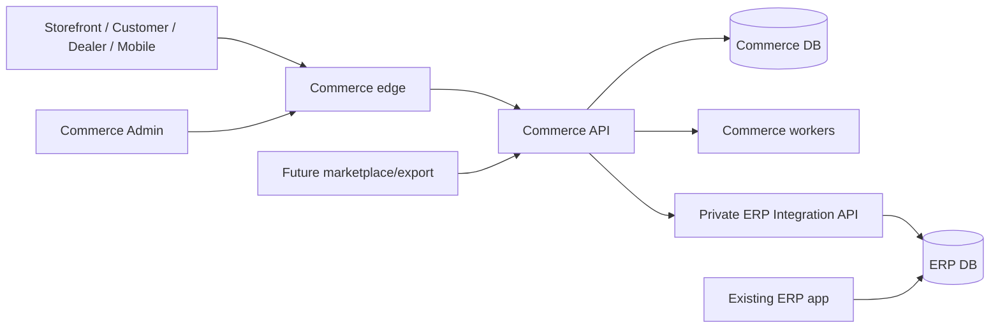

# Service Boundary Architecture

```mermaid
flowchart LR
  Clients["Storefront / Customer / Dealer / Mobile"] --> Edge["Commerce edge"]
  Admin["Commerce Admin"] --> Edge
  Edge --> API["Commerce API"]
  API --> CDB[("Commerce DB")]
  API --> Workers["Commerce workers"]
  API --> INT["Private ERP Integration API"]
  INT --> EDB[("ERP DB")]
  ERP["Existing ERP app"] --> EDB
  Market["Future marketplace/export"] --> API
```

No client or Commerce database connection reaches ERP directly.

