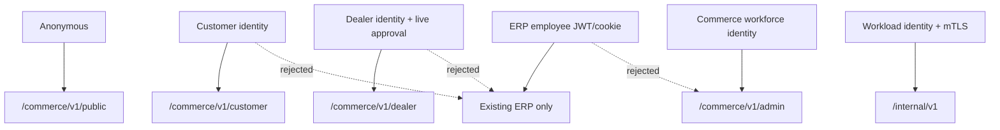

# Authentication Trust Domains

```mermaid
flowchart TB
  A["Anonymous"] --> PUB["/commerce/v1/public"]
  C["Customer identity"] --> CU["/commerce/v1/customer"]
  D["Dealer identity + live approval"] --> DE["/commerce/v1/dealer"]
  W["Commerce workforce identity"] --> AD["/commerce/v1/admin"]
  S["Workload identity + mTLS"] --> IN["/internal/v1"]
  E["ERP employee JWT/cookie"] --> ERP["Existing ERP only"]
  E -. "rejected" .-> AD
  C -. "rejected" .-> ERP
  D -. "rejected" .-> ERP
```

