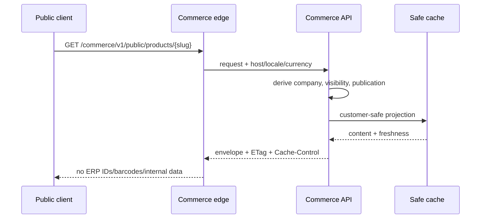

# Public Catalogue Request

```mermaid
sequenceDiagram
  participant U as Public client
  participant E as Commerce edge
  participant A as Commerce API
  participant C as Safe cache
  U->>E: GET /commerce/v1/public/products/{slug}
  E->>A: request + host/locale/currency
  A->>A: derive company, visibility, publication
  A->>C: customer-safe projection
  C-->>A: content + freshness
  A-->>E: envelope + ETag + Cache-Control
  E-->>U: no ERP IDs/barcodes/internal data
```

