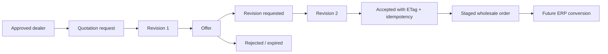

# B2B Quotation and Order Flow

```mermaid
flowchart LR
  A["Approved dealer"] --> Q["Quotation request"]
  Q --> R1["Revision 1"]
  R1 --> O["Offer"]
  O --> RR["Revision requested"]
  RR --> R2["Revision 2"]
  R2 --> AC["Accepted with ETag + idempotency"]
  AC --> SO["Staged wholesale order"]
  SO --> EC["Future ERP conversion"]
  O --> X["Rejected / expired"]
```

