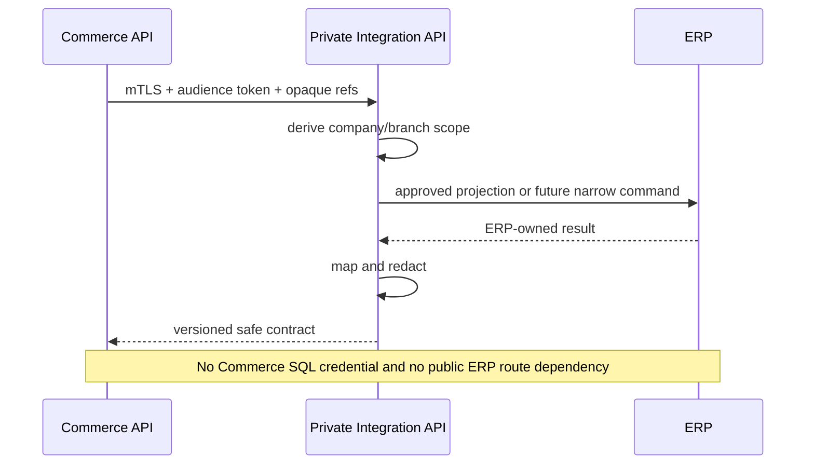

# ERP Integration

```mermaid
sequenceDiagram
  participant C as Commerce API
  participant I as Private Integration API
  participant E as ERP
  C->>I: mTLS + audience token + opaque refs
  I->>I: derive company/branch scope
  I->>E: approved projection or future narrow command
  E-->>I: ERP-owned result
  I->>I: map and redact
  I-->>C: versioned safe contract
  Note over C,E: No Commerce SQL credential and no public ERP route dependency
```

