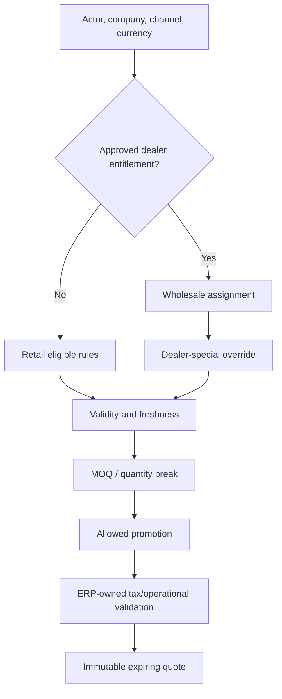

# Price Resolution

```mermaid
flowchart TD
  R["Actor, company, channel, currency"] --> G{"Approved dealer entitlement?"}
  G -->|"No"| RP["Retail eligible rules"]
  G -->|"Yes"| WP["Wholesale assignment"]
  WP --> SP["Dealer-special override"]
  RP --> V["Validity and freshness"]
  SP --> V
  V --> M["MOQ / quantity break"]
  M --> P["Allowed promotion"]
  P --> T["ERP-owned tax/operational validation"]
  T --> Q["Immutable expiring quote"]
```

