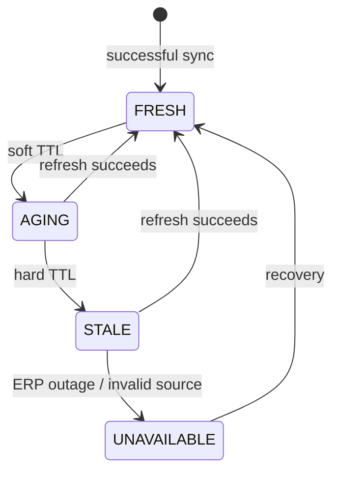

# Availability Freshness

```mermaid
stateDiagram-v2
  [*] --> FRESH: successful sync
  FRESH --> AGING: soft TTL
  AGING --> FRESH: refresh succeeds
  AGING --> STALE: hard TTL
  STALE --> FRESH: refresh succeeds
  STALE --> UNAVAILABLE: ERP outage / invalid source
  UNAVAILABLE --> FRESH: recovery
```

STALE and UNAVAILABLE block transactional promises and reveal no exact stock or branch data.

