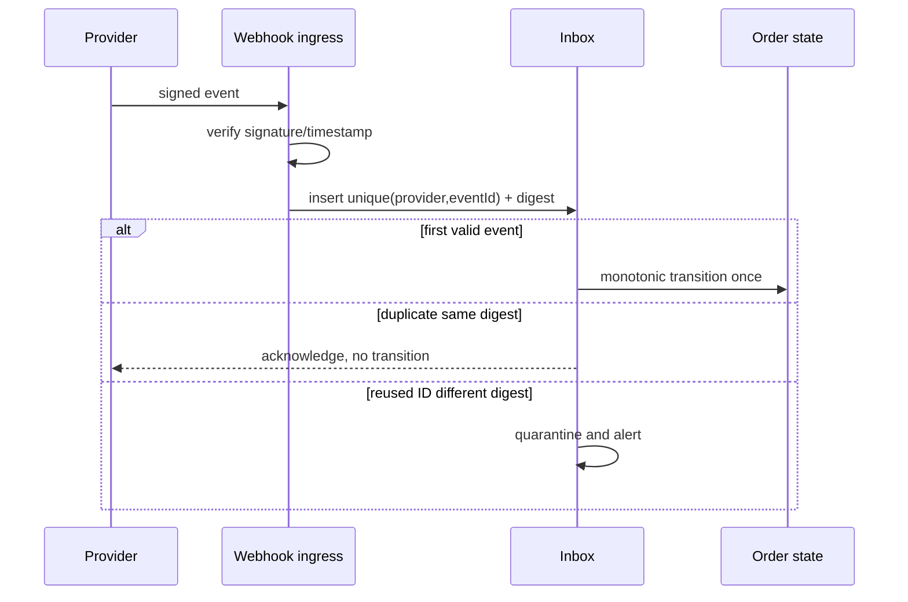

# Payment Webhook Idempotency

```mermaid
sequenceDiagram
  participant P as Provider
  participant W as Webhook ingress
  participant I as Inbox
  participant O as Order state
  P->>W: signed event
  W->>W: verify signature/timestamp
  W->>I: insert unique(provider,eventId) + digest
  alt first valid event
    I->>O: monotonic transition once
  else duplicate same digest
    I-->>P: acknowledge, no transition
  else reused ID different digest
    I->>I: quarantine and alert
  end
```

