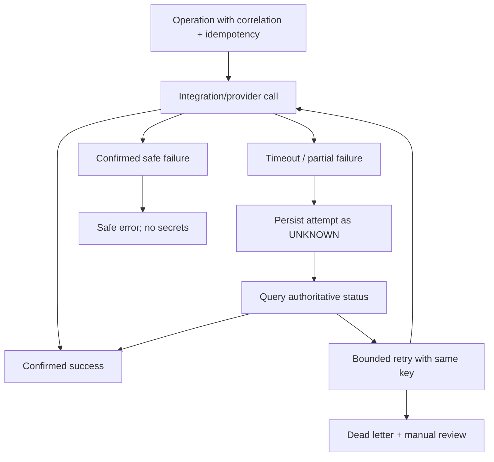

# Failure Recovery

```mermaid
flowchart TD
  OP["Operation with correlation + idempotency"] --> CALL["Integration/provider call"]
  CALL --> OK["Confirmed success"]
  CALL --> KNOWN["Confirmed safe failure"]
  CALL --> UNKNOWN["Timeout / partial failure"]
  UNKNOWN --> LOG["Persist attempt as UNKNOWN"]
  LOG --> RECON["Query authoritative status"]
  RECON --> OK
  RECON --> RETRY["Bounded retry with same key"]
  RETRY --> CALL
  RETRY --> DLQ["Dead letter + manual review"]
  KNOWN --> SAFE["Safe error; no secrets"]
```

