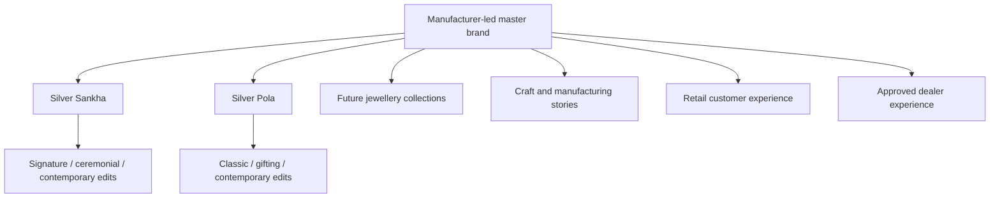

# Brand Architecture

```mermaid
flowchart TD
  B["Manufacturer-led master brand"] --> S["Silver Sankha"]
  B --> P["Silver Pola"]
  B --> F["Future jewellery collections"]
  B --> C["Craft and manufacturing stories"]
  B --> T["Retail customer experience"]
  B --> D["Approved dealer experience"]
  S --> SIG["Signature / ceremonial / contemporary edits"]
  P --> POL["Classic / gifting / contemporary edits"]
```

