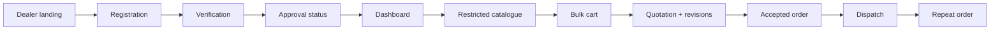

# B2B Journey

```mermaid
flowchart LR
  L["Dealer landing"] --> R["Registration"]
  R --> V["Verification"]
  V --> A["Approval status"]
  A --> D["Dashboard"]
  D --> C["Restricted catalogue"]
  C --> B["Bulk cart"]
  B --> Q["Quotation + revisions"]
  Q --> O["Accepted order"]
  O --> DS["Dispatch"]
  DS --> RP["Repeat order"]
```

