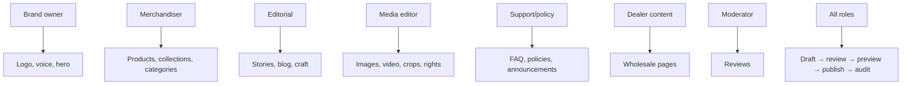

# CMS Ownership

```mermaid
flowchart TD
  BO["Brand owner"] --> MARK["Logo, voice, hero"]
  ME["Merchandiser"] --> CAT["Products, collections, categories"]
  ED["Editorial"] --> BLOG["Stories, blog, craft"]
  MEDIA["Media editor"] --> ASSET["Images, video, crops, rights"]
  SUPPORT["Support/policy"] --> FAQ["FAQ, policies, announcements"]
  DEALER["Dealer content"] --> WHOLE["Wholesale pages"]
  REVIEW["Moderator"] --> REV["Reviews"]
  ALL["All roles"] --> WF["Draft → review → preview → publish → audit"]
```

