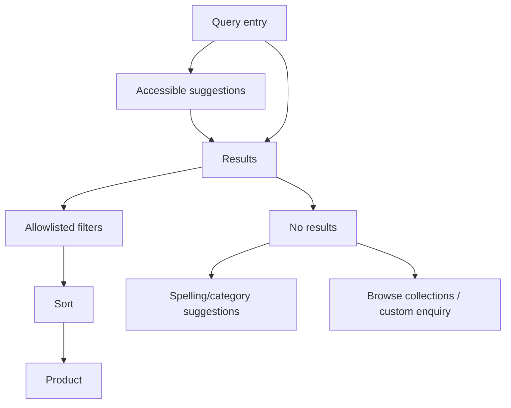

# Search Flow

```mermaid
flowchart TD
  Q["Query entry"] --> SUG["Accessible suggestions"]
  SUG --> RESULTS["Results"]
  Q --> RESULTS
  RESULTS --> FILTER["Allowlisted filters"]
  FILTER --> SORT["Sort"]
  SORT --> PRODUCT["Product"]
  RESULTS --> ZERO["No results"]
  ZERO --> SPELL["Spelling/category suggestions"]
  ZERO --> SUPPORT["Browse collections / custom enquiry"]
```

