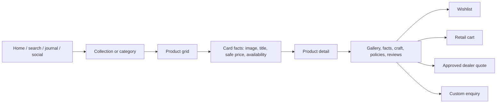

# Product Discovery

```mermaid
flowchart LR
  ENTRY["Home / search / journal / social"] --> TAX["Collection or category"]
  TAX --> GRID["Product grid"]
  GRID --> QUICK["Card facts: image, title, safe price, availability"]
  QUICK --> PDP["Product detail"]
  PDP --> TRUST["Gallery, facts, craft, policies, reviews"]
  TRUST --> SAVE["Wishlist"]
  TRUST --> CART["Retail cart"]
  TRUST --> QUOTE["Approved dealer quote"]
  TRUST --> CUSTOM["Custom enquiry"]
```

