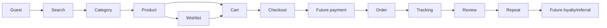

# B2C Journey

```mermaid
flowchart LR
  G["Guest"] --> S["Search"]
  S --> C["Category"]
  C --> P["Product"]
  P --> W["Wishlist"]
  P --> CA["Cart"]
  W --> CA
  CA --> CH["Checkout"]
  CH --> PAY["Future payment"]
  PAY --> O["Order"]
  O --> T["Tracking"]
  T --> R["Review"]
  R --> RP["Repeat"]
  RP --> L["Future loyalty/referral"]
```

