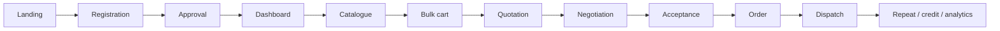

# B2B Journey

```mermaid
flowchart LR
  L["Landing"] --> REG["Registration"]
  REG --> AP["Approval"]
  AP --> DB["Dashboard"]
  DB --> CAT["Catalogue"]
  CAT --> BULK["Bulk cart"]
  BULK --> Q["Quotation"]
  Q --> N["Negotiation"]
  N --> AC["Acceptance"]
  AC --> O["Order"]
  O --> DS["Dispatch"]
  DS --> RP["Repeat / credit / analytics"]
```

