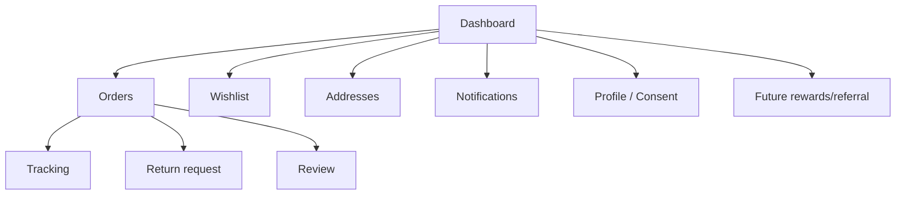

# Customer Flow

```mermaid
flowchart TD
  DASH["Dashboard"] --> ORD["Orders"]
  DASH --> WISH["Wishlist"]
  DASH --> ADDR["Addresses"]
  DASH --> NOTE["Notifications"]
  DASH --> PROF["Profile / Consent"]
  ORD --> TRACK["Tracking"]
  ORD --> RET["Return request"]
  ORD --> REV["Review"]
  DASH --> FUT["Future rewards/referral"]
```

