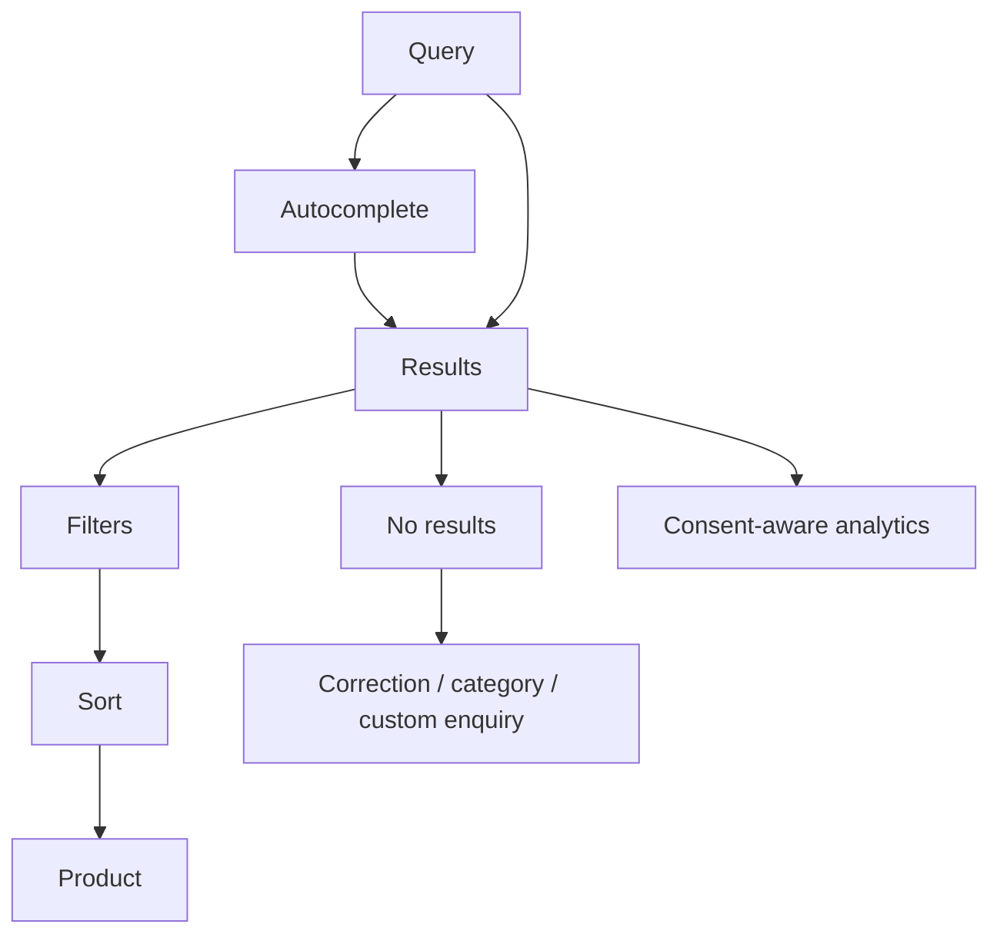

# Search Flow

```mermaid
flowchart TD
  Q["Query"] --> AUTO["Autocomplete"]
  AUTO --> RES["Results"]
  Q --> RES
  RES --> FIL["Filters"]
  FIL --> SORT["Sort"]
  SORT --> PDP["Product"]
  RES --> ZERO["No results"]
  ZERO --> CORR["Correction / category / custom enquiry"]
  RES --> ANA["Consent-aware analytics"]
```

