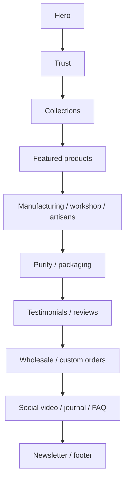

# Homepage Sections

```mermaid
flowchart TD
  H["Hero"] --> T["Trust"]
  T --> C["Collections"]
  C --> F["Featured products"]
  F --> M["Manufacturing / workshop / artisans"]
  M --> P["Purity / packaging"]
  P --> R["Testimonials / reviews"]
  R --> W["Wholesale / custom orders"]
  W --> S["Social video / journal / FAQ"]
  S --> N["Newsletter / footer"]
```

