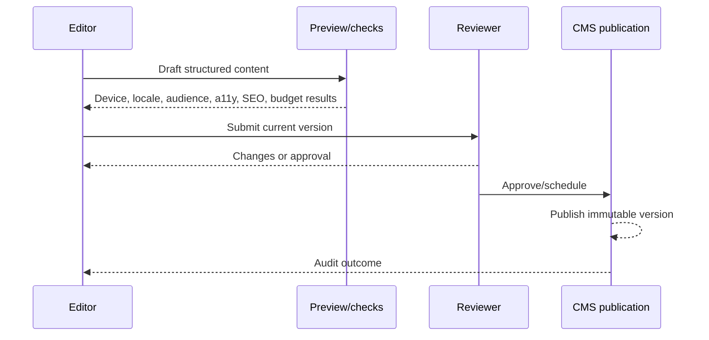

# Content Publishing

```mermaid
sequenceDiagram
  participant E as Editor
  participant P as Preview/checks
  participant R as Reviewer
  participant C as CMS publication
  E->>P: Draft structured content
  P-->>E: Device, locale, audience, a11y, SEO, budget results
  E->>R: Submit current version
  R-->>E: Changes or approval
  R->>C: Approve/schedule
  C-->>C: Publish immutable version
  C-->>E: Audit outcome
```

