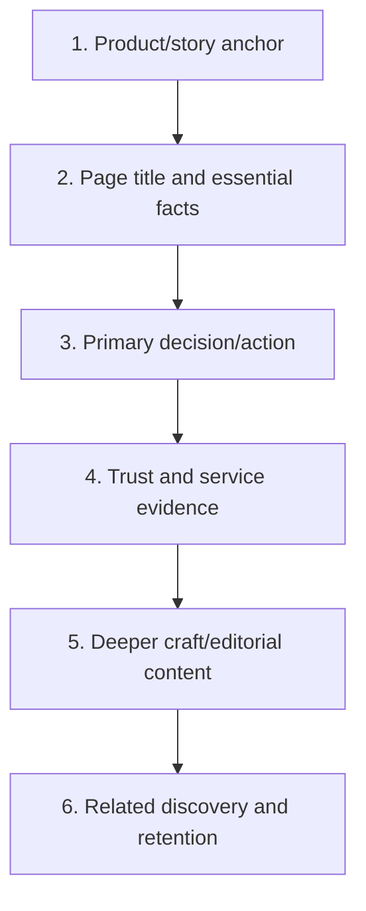

# Visual Hierarchy

```mermaid
flowchart TD
  A["1. Product/story anchor"] --> B["2. Page title and essential facts"]
  B --> C["3. Primary decision/action"]
  C --> D["4. Trust and service evidence"]
  D --> E["5. Deeper craft/editorial content"]
  E --> F["6. Related discovery and retention"]
```

