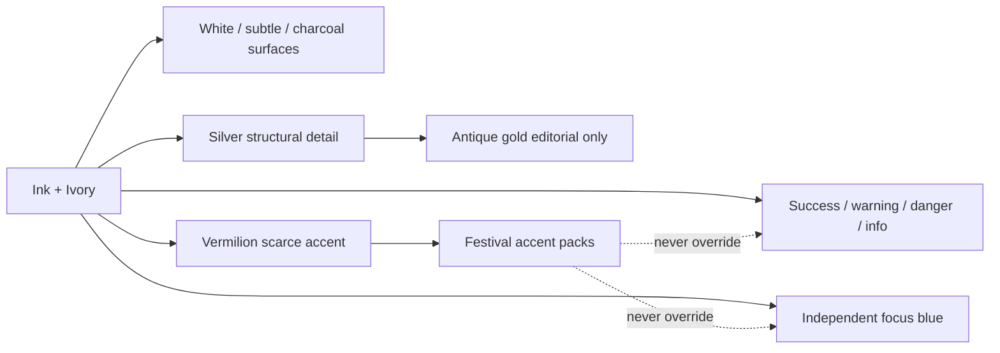

# Color Relationships

```mermaid
flowchart LR
  CORE["Ink + Ivory"] --> SURF["White / subtle / charcoal surfaces"]
  CORE --> METAL["Silver structural detail"]
  CORE --> ACC["Vermilion scarce accent"]
  METAL --> EDIT["Antique gold editorial only"]
  CORE --> SEM["Success / warning / danger / info"]
  CORE --> FOCUS["Independent focus blue"]
  ACC --> THEMES["Festival accent packs"]
  THEMES -. "never override" .-> SEM
  THEMES -. "never override" .-> FOCUS
```

