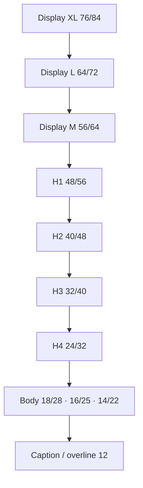

# Typography Scale

```mermaid
flowchart TD
  DX["Display XL 76/84"] --> DL["Display L 64/72"]
  DL --> DM["Display M 56/64"]
  DM --> H1["H1 48/56"]
  H1 --> H2["H2 40/48"]
  H2 --> H3["H3 32/40"]
  H3 --> H4["H4 24/32"]
  H4 --> BODY["Body 18/28 · 16/25 · 14/22"]
  BODY --> CAP["Caption / overline 12"]
```

