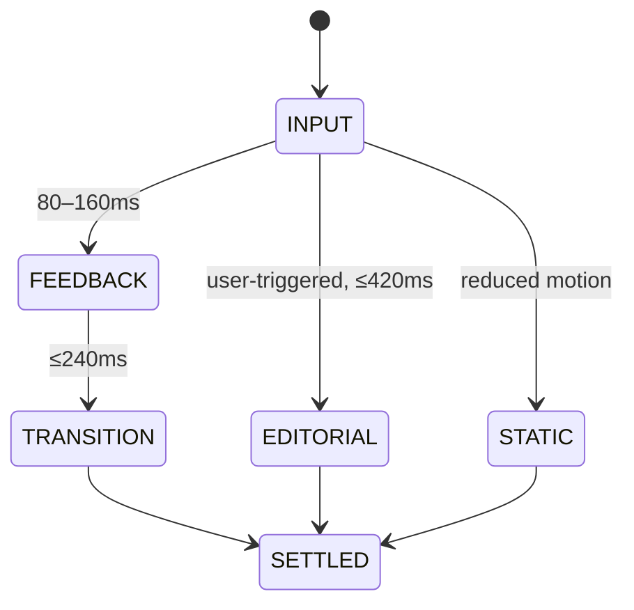

# Motion Flow

```mermaid
stateDiagram-v2
  [*] --> INPUT
  INPUT --> FEEDBACK: 80–160ms
  FEEDBACK --> TRANSITION: ≤240ms
  TRANSITION --> SETTLED
  INPUT --> EDITORIAL: user-triggered, ≤420ms
  EDITORIAL --> SETTLED
  INPUT --> STATIC: reduced motion
  STATIC --> SETTLED
```

