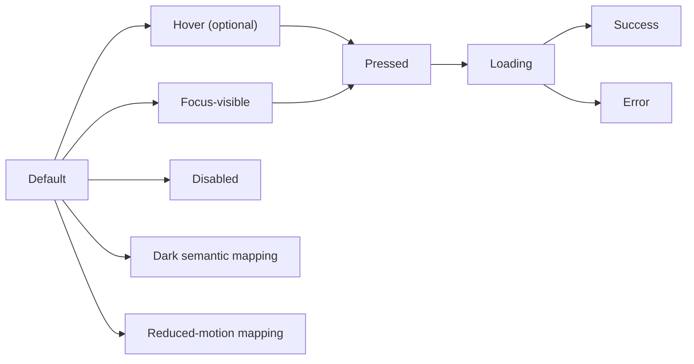

# Component States

```mermaid
flowchart LR
  D["Default"] --> H["Hover (optional)"]
  D --> F["Focus-visible"]
  H --> P["Pressed"]
  F --> P
  P --> L["Loading"]
  L --> S["Success"]
  L --> E["Error"]
  D --> X["Disabled"]
  D --> DARK["Dark semantic mapping"]
  D --> RM["Reduced-motion mapping"]
```

