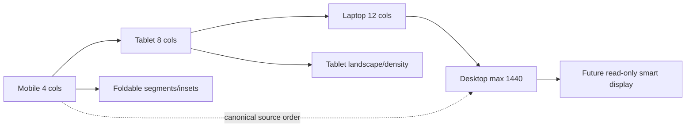

# Responsive Behaviour

```mermaid
flowchart LR
  M["Mobile 4 cols"] --> T["Tablet 8 cols"]
  T --> L["Laptop 12 cols"]
  L --> D["Desktop max 1440"]
  M --> F["Foldable segments/insets"]
  T --> LAND["Tablet landscape/density"]
  D --> SMART["Future read-only smart display"]
  M -. "canonical source order" .-> D
```

