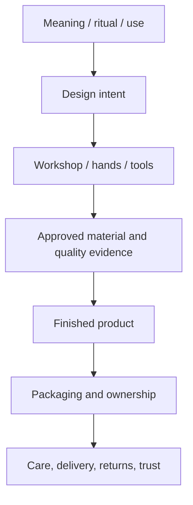

# Brand Story Flow

```mermaid
flowchart TD
  MEAN["Meaning / ritual / use"] --> INTENT["Design intent"]
  INTENT --> MAKE["Workshop / hands / tools"]
  MAKE --> EVID["Approved material and quality evidence"]
  EVID --> OBJECT["Finished product"]
  OBJECT --> PACK["Packaging and ownership"]
  PACK --> SERVICE["Care, delivery, returns, trust"]
```

