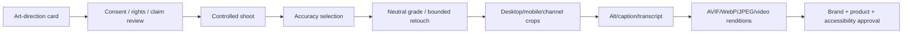

# Photography Flow

```mermaid
flowchart LR
  BRIEF["Art-direction card"] --> RIGHTS["Consent / rights / claim review"]
  RIGHTS --> SHOOT["Controlled shoot"]
  SHOOT --> SELECT["Accuracy selection"]
  SELECT --> GRADE["Neutral grade / bounded retouch"]
  GRADE --> CROP["Desktop/mobile/channel crops"]
  CROP --> ACCESS["Alt/caption/transcript"]
  ACCESS --> OPT["AVIF/WebP/JPEG/video renditions"]
  OPT --> APPROVE["Brand + product + accessibility approval"]
```

