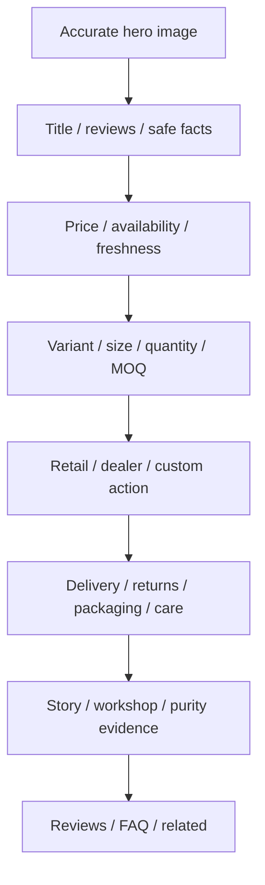

# Product Presentation

```mermaid
flowchart TD
  IMG["Accurate hero image"] --> ID["Title / reviews / safe facts"]
  ID --> PRICE["Price / availability / freshness"]
  PRICE --> VAR["Variant / size / quantity / MOQ"]
  VAR --> ACT["Retail / dealer / custom action"]
  ACT --> SERV["Delivery / returns / packaging / care"]
  SERV --> CRAFT["Story / workshop / purity evidence"]
  CRAFT --> REV["Reviews / FAQ / related"]
```

