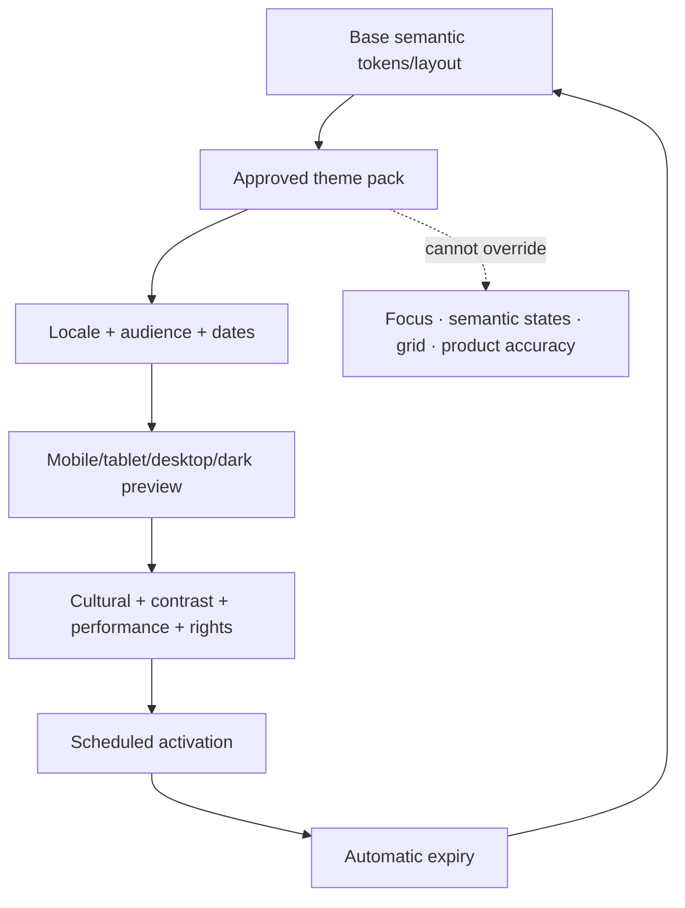

# Theme Engine

```mermaid
flowchart TD
  BASE["Base semantic tokens/layout"] --> PACK["Approved theme pack"]
  PACK --> SCOPE["Locale + audience + dates"]
  SCOPE --> PRE["Mobile/tablet/desktop/dark preview"]
  PRE --> CHECK["Cultural + contrast + performance + rights"]
  CHECK --> ACTIVE["Scheduled activation"]
  ACTIVE --> EXP["Automatic expiry"]
  EXP --> BASE
  PACK -. "cannot override" .-> LOCK["Focus · semantic states · grid · product accuracy"]
```

