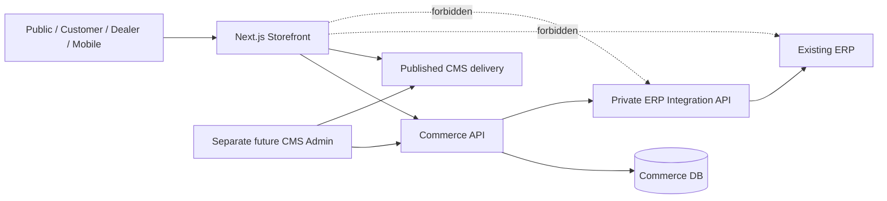

# Frontend System Architecture

```mermaid
flowchart LR
  U["Public / Customer / Dealer / Mobile"] --> SF["Next.js Storefront"]
  SF --> CA["Commerce API"]
  SF --> CMS["Published CMS delivery"]
  CA --> CDB[("Commerce DB")]
  CA --> IA["Private ERP Integration API"]
  IA --> ERP["Existing ERP"]
  ADM["Separate future CMS Admin"] --> CA
  ADM --> CMS
  SF -. "forbidden" .-> ERP
  SF -. "forbidden" .-> IA
```

