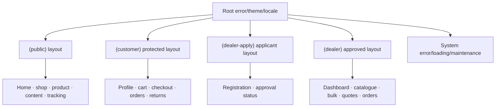

# Route and Layout Hierarchy

```mermaid
flowchart TD
  ROOT["Root error/theme/locale"] --> PUB["(public) layout"]
  ROOT --> CU["(customer) protected layout"]
  ROOT --> DA["(dealer-apply) applicant layout"]
  ROOT --> DE["(dealer) approved layout"]
  ROOT --> SYS["System error/loading/maintenance"]
  PUB --> PAGES["Home · shop · product · content · tracking"]
  CU --> CP["Profile · cart · checkout · orders · returns"]
  DA --> APP["Registration · approval status"]
  DE --> DP["Dashboard · catalogue · bulk · quotes · orders"]
```

