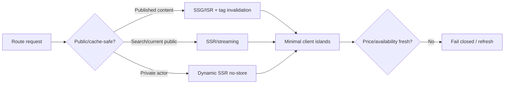

# Rendering and Caching

```mermaid
flowchart LR
  REQ["Route request"] --> CLASS{"Public/cache-safe?"}
  CLASS -->|"Published content"| ISR["SSG/ISR + tag invalidation"]
  CLASS -->|"Search/current public"| SSR["SSR/streaming"]
  CLASS -->|"Private actor"| DYN["Dynamic SSR no-store"]
  ISR --> ISLAND["Minimal client islands"]
  SSR --> ISLAND
  DYN --> ISLAND
  ISLAND --> FRESH{"Price/availability fresh?"}
  FRESH -->|"No"| CLOSED["Fail closed / refresh"]
```

