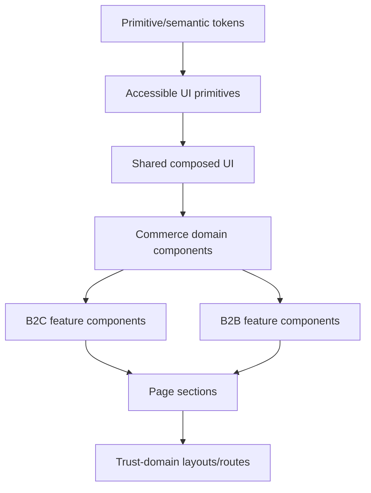

# Component Layering

```mermaid
flowchart TD
  TOK["Primitive/semantic tokens"] --> PRIM["Accessible UI primitives"]
  PRIM --> SH["Shared composed UI"]
  SH --> DOM["Commerce domain components"]
  DOM --> B2C["B2C feature components"]
  DOM --> B2B["B2B feature components"]
  B2C --> SEC["Page sections"]
  B2B --> SEC
  SEC --> LAY["Trust-domain layouts/routes"]
```

