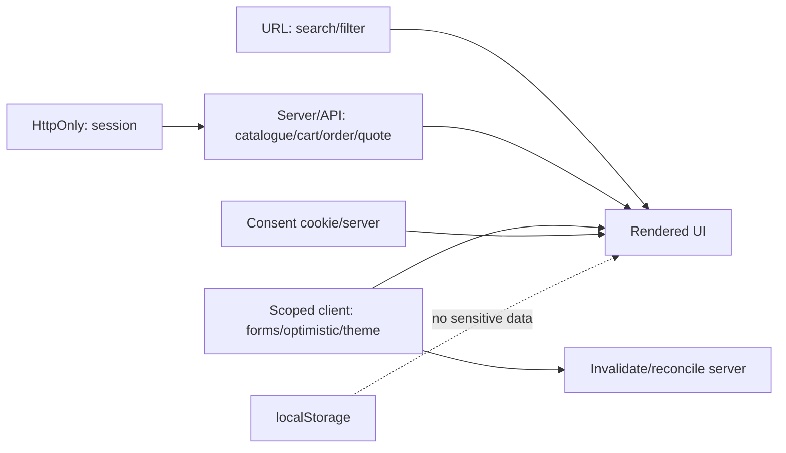

# State Ownership

```mermaid
flowchart LR
  URL["URL: search/filter"] --> UI["Rendered UI"]
  SERVER["Server/API: catalogue/cart/order/quote"] --> UI
  COOKIE["HttpOnly: session"] --> SERVER
  CLIENT["Scoped client: forms/optimistic/theme"] --> UI
  CONSENT["Consent cookie/server"] --> UI
  CLIENT --> SYNC["Invalidate/reconcile server"]
  LOCAL["localStorage"] -. "no sensitive data" .-> UI
```

