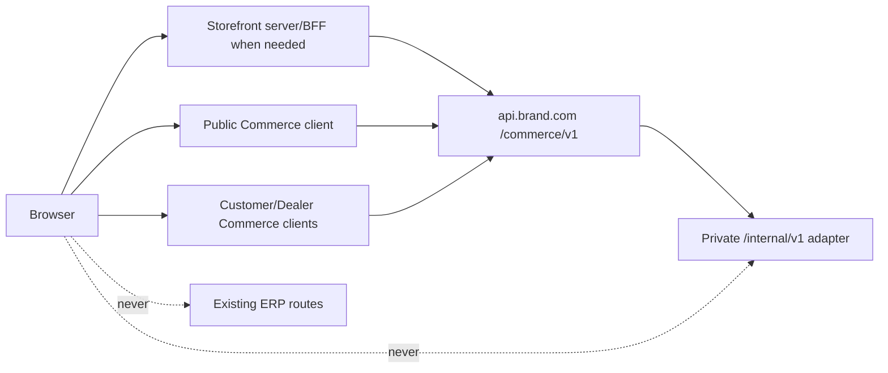

# API Client Boundaries

```mermaid
flowchart LR
  BR["Browser"] --> BFF["Storefront server/BFF when needed"]
  BR --> PUB["Public Commerce client"]
  BR --> AUTH["Customer/Dealer Commerce clients"]
  BFF --> COM["api.brand.com /commerce/v1"]
  PUB --> COM
  AUTH --> COM
  COM --> INT["Private /internal/v1 adapter"]
  BR -. "never" .-> INT
  BR -. "never" .-> ERP["Existing ERP routes"]
```

