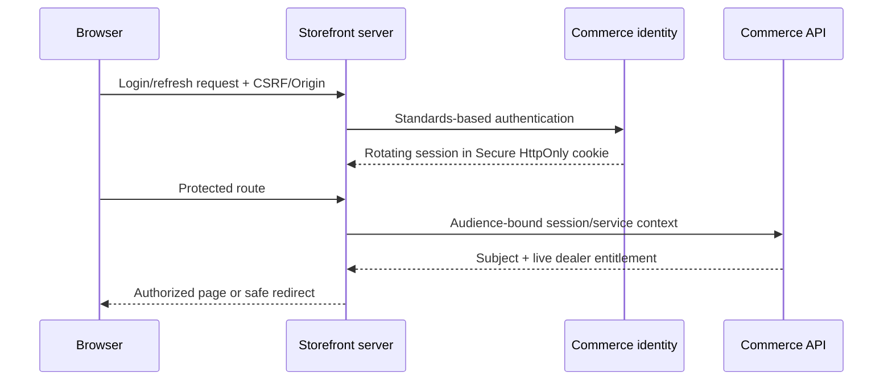

# Authentication Flow

```mermaid
sequenceDiagram
  participant B as Browser
  participant S as Storefront server
  participant I as Commerce identity
  participant A as Commerce API
  B->>S: Login/refresh request + CSRF/Origin
  S->>I: Standards-based authentication
  I-->>S: Rotating session in Secure HttpOnly cookie
  B->>S: Protected route
  S->>A: Audience-bound session/service context
  A-->>S: Subject + live dealer entitlement
  S-->>B: Authorized page or safe redirect
```

