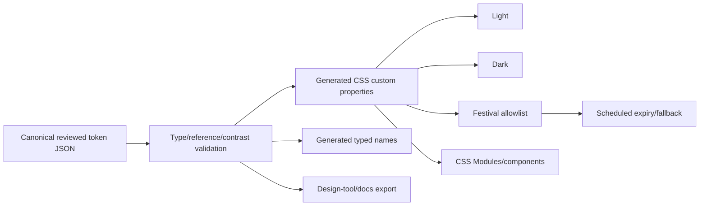

# Theme and Token Flow

```mermaid
flowchart LR
  SRC["Canonical reviewed token JSON"] --> VAL["Type/reference/contrast validation"]
  VAL --> CSS["Generated CSS custom properties"]
  VAL --> TYPES["Generated typed names"]
  VAL --> DOC["Design-tool/docs export"]
  CSS --> LIGHT["Light"]
  CSS --> DARK["Dark"]
  CSS --> FEST["Festival allowlist"]
  FEST --> EXP["Scheduled expiry/fallback"]
  CSS --> MOD["CSS Modules/components"]
```

