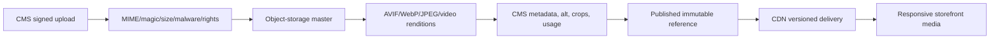

# Media Pipeline

```mermaid
flowchart LR
  UP["CMS signed upload"] --> CHECK["MIME/magic/size/malware/rights"]
  CHECK --> MASTER["Object-storage master"]
  MASTER --> REND["AVIF/WebP/JPEG/video renditions"]
  REND --> META["CMS metadata, alt, crops, usage"]
  META --> PUB["Published immutable reference"]
  PUB --> CDN["CDN versioned delivery"]
  CDN --> SF["Responsive storefront media"]
```

