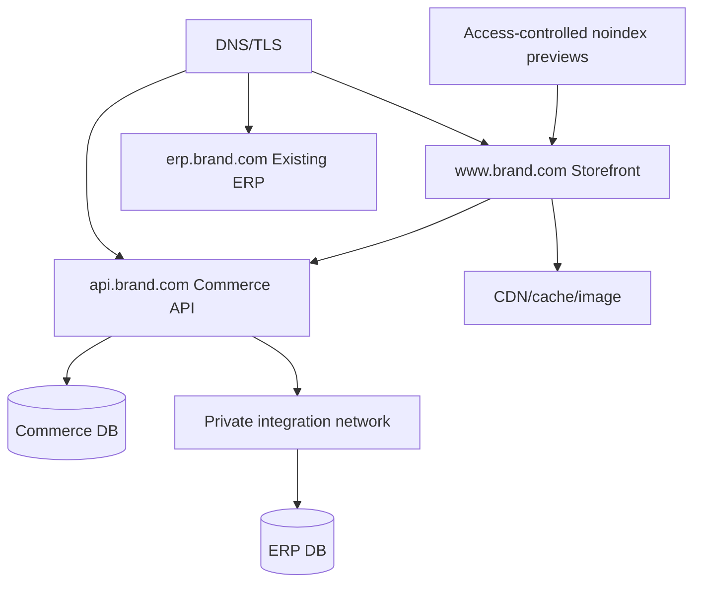

# Deployment Topology

```mermaid
flowchart TB
  DNS["DNS/TLS"] --> WWW["www.brand.com Storefront"]
  DNS --> API["api.brand.com Commerce API"]
  DNS --> ERP["erp.brand.com Existing ERP"]
  WWW --> CDN["CDN/cache/image"]
  WWW --> API
  API --> CDB[("Commerce DB")]
  API --> INT["Private integration network"]
  INT --> ERPDB[("ERP DB")]
  PRE["Access-controlled noindex previews"] --> WWW
```

