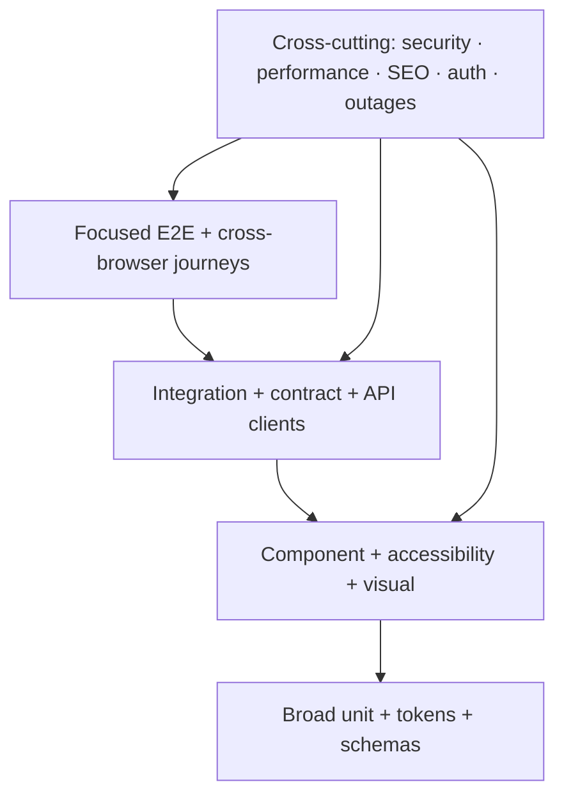

# Testing Pyramid

```mermaid
flowchart TD
  E2E["Focused E2E + cross-browser journeys"] --> INT["Integration + contract + API clients"]
  INT --> COMP["Component + accessibility + visual"]
  COMP --> UNIT["Broad unit + tokens + schemas"]
  SIDE["Cross-cutting: security · performance · SEO · auth · outages"] --> E2E
  SIDE --> INT
  SIDE --> COMP
```

